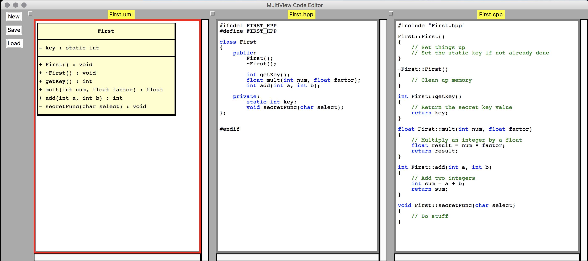

# multiview_poc
Proof of concept UML and code sync editor.

This project was created as a learning foundation to understand how to create a text editor and a graphic (canvas) view to experiment with as I practice Python and find out if (and how) certain things can be achieved before launching a more formal project.

This version of the editor has two text edit panels, one for a C++ header file and the other for a C++ code file. It also uses a canvas to create a UML class diagram. The intent overall is to figure out how to synchronize multiplie views of the single underlying code "model" or complete object. The eventual goal is to be able to add to, remove from, or modify any of the individual views and have the editor maintain all corresponding views to reflect the changes.

Things this editor can do so far:
- Key word highlighting for a subset of C++ code words.
- With empty initial views, type 'class <Classname>' and skeleton code to completed for the header and cpp file, including #define guards, #include of the header in the cpp file, default constructor and default destructor, and adding the class name to the class diagram view.
- Each function/method added to the header file auto-populates a skeleton function in the cpp file and is added to the UML class diagram.
- Each variable/member added to the header file auto-populates the class diagram view.
- Duplicate function and variable names are detected and not reflected in other views.
- Parameter names for a function can be changed after the initial entry in the header file and will update the cpp and class diagram views.
- The New, Save, and Load functions work. File names in the file save/load dialog should not include extensions, they are used to save .hpp, .cpp, and .json files or to load .hpp and .cpp files with the same base name.
- The order of functions and variables in the class diagram matches the order in the header file. New functions added to the header populate code in the cpp file in matching order where possible. Functions which already have an entry in the cpp file will be left in their current location.
- All details needed in the header, cpp, and class diagrams are stored in a composite JSON structure as the fundamental model of the class/object. Eventually this can be extended to use data from a Detailed Design document or requirements to sync comments in the code with the design documentation.

Future updates:
- Explore design document linking
- Test generation
- Class inheritance and connections, with multiple interacting classes.

Python Dependencies: tkinter, json
Using Python 3.7, tested so far only on a Mac

Updates: 
2019-04-09: UML diagram editing support started -- class in New (empty) editor can be named from a right-click context menu on the class diagram. Hooks in place to edit and insert variables and functions using context menus for the class diagram, but actual edit and insertions not implemented yet.

2019-04-15: Functions can be inserted directly from the UML class diagram using a context menu to get a text box. Type into the text box as it would appear in the class diagram (for instance, without the quotes, "+ add(int a, int b) : int". This will auto-populate the hpp and cpp views to match the new function. Also, the program now reads in previously stored JSON files as well as hpp and cpp files for the same base name, and loads the JSON file data into the internal model.
